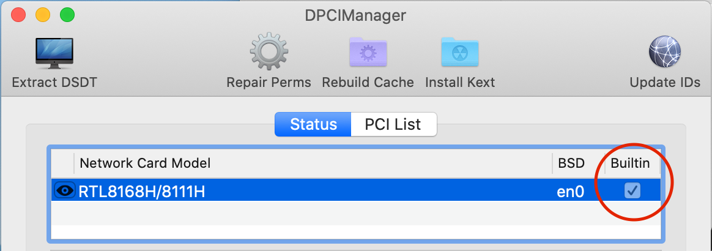

# Lazy Man's Guide: macOS Catalina on AMD <!-- omit in toc -->

- [Introduction](#introduction)
- [Terminology](#terminology)
- [Resources and Tools](#resources-and-tools)
  - [References and Guides](#references-and-guides)
  - [Required Software](#required-software)
  - [Kexts](#kexts)
  - [Useful Software](#useful-software)
  - [Hardware](#hardware)
- [System Specs](#system-specs)
- [Assorted Notes](#assorted-notes)
- [Instructions](#instructions)
  - [Step 1 - Prepare Installation Files](#step-1---prepare-installation-files)
  - [Step 2 - Update config.plist](#step-2---update-configplist)
  - [Step 3 - Install](#step-3---install)
  - [Step 4 - Boot from SSD](#step-4---boot-from-ssd)
    - [Step 4.1 - Dual boot](#step-41---dual-boot)
  - [Step 5 - Make Ethernet "Built-in"](#step-5---make-ethernet-built-in)
  - [Step 6 (Optional) - Secure Your Installation](#step-6-optional---secure-your-installation)
- [Known Issues](#known-issues)
- [Update History](#update-history)
  
## Introduction

This guide is based on my personal experience of installing Hackintosh Catalina on a Ryzen system running Windows 10.
I created this guide specifically for newcomers (like myself) because I found it difficult to start building my
own system without spending many hours on reading forums and serious in-depth guides. Some people just want an easy
one-off exercise and this guide tries to help. No prior Hackintosh knowledge is required to follow this guide.

This repo also contains my OpenCore files (for versions 0.5.5-0.5.6, 0.5.8-0.5.9) and config.plist just in case you
have the same (or very similar) hardware. Do not use these files without changes unless you have the same
motherboard model.

## Terminology

* _Kext_ - macOS Kernel EXTension. Kext is much like a device driver in Windows. Hackintosh requires some Kexts to boot macOS properly.
* _EFI_ - Extensible Firmware Inrterface. Basically, EFI is a new way to boot operating system. Prior to EFI booting
process involved dealing with MBR records.
* _ESP_ - EFI System Partition. ESP is a disk partition formatted as FAT32 and designated specifically for booting.
* _Plist_ - Property list. Plist is a file in an XML format used by macOS and many macOS-related tools and programs to store
settings and object properties.
* _Boot loader_ - A software responsible for booting macOS. Currently there are two boot loaders in active use - Clover and OpenCore.

## Resources and Tools
### References and Guides
1. Amd-osx.com Vanilla Guide: https://vanilla.amd-osx.com/ (good starting point but instructions are pretty basic)
2. Snazzy Labs video: https://www.youtube.com/watch?v=l_QPLl81GrY (the mother of all AMD Catalina Hackintosh videos) - you should watch this before doing anything
3. OpenCore Install Guide: https://dortania.github.io/OpenCore-Install-Guide/ and especially AMD part: https://dortania.github.io/OpenCore-Install-Guide/AMD/zen.html (an official guide, read it if you ran into problems)
4. OpenCore Vanilla Guide, Step by Step: [https://www.olarila.com/topic/8918-opencore-vanilla-guide](https://www.olarila.com/topic/8918-opencore-vanilla-guide-step-by-step-full-dsdt-patched-or-ssdt/) by MaLd0n (very long and detailed sequence of instructions, covers AMD and Intel)

### Required Software
The software below is required for installation from Windows.
1. gibMacOS: https://github.com/corpnewt/gibMacOS
2. SSDT Time: https://github.com/corpnewt/SSDTTime
3. GenSMBIOS: https://github.com/corpnewt/GenSMBIOS 
4. ProperTree: https://github.com/corpnewt/ProperTree
### Kexts
You will need some kexts to install your system:
1. Kexts archive: [https://onedrive.live.com/?authkey=%21APj...](https://onedrive.live.com/?authkey=%21APjCyRpzoAKp4xs&id=FE4038DA929BFB23%21455036&cid=FE4038DA929BFB23)
2. Kext Knowledge Base: https://kb.amd-osx.com/guides/MJ/kexts.html

### Useful Software
1. ESP Mounter Pro: https://www.insanelymac.com/forum/files/file/566-esp-mounter-pro/ (macOS)
2. DPCIManager: https://sourceforge.net/projects/dpcimanager/ (macOS)
3. rEFInd: https://www.rodsbooks.com/refind/ (EFI)

### Hardware
1. Separate SSD disk to install macOS. Even though there are ways to install Windows and macOS on the same drive you don't want to do this.
2. Any USB 3.0 Flash Drive to store macOS installation and boot files.

## System Specs

These are the specs for my AMD system. Files in this repo (OpenCore configuration, drivers and .kexts) work on this hardware.

* CPU Ryzen 2700X, not overclocked
* Motherboard ASRock B450M Pro4
* RAM G-Skill Ripjaws V 2x16Gb 3200 CL16
* Video Sapphire RX 570 4Gb
* SSD Crucial MX500 500Gb SATA3

These files will also probably work with RX 560, RX 580 and RX 590 GPUs. RX 550 won't work.

## Assorted Notes

1. Boot loaders - Clover vs OpenCore. You will find a lot of info about Clover-based builds. But you need to go with OpenCore("OC"). Even though Clover is easier to configure, new Catalinas (10.15.2 and up) only work with OC. [More info](https://dortania.github.io/OpenCore-Install-Guide/why-oc.html)
2. All Catalina versions (10.15.*) are still buggy. If you stumble upon any bugs these may be genuine macOS problems, not issues with your setup.
3. If you plan to dualboot (and you probably do), be careful during the installation! macOS will kill your Windows partition in a hearbeat if you specify a wrong disk or a wrong partition. There is no undo.

## Instructions

If your hardware is close enough to mine (same MB, some Ryzen CPU, Polaris graphics card) you can use my OC files from this repo (just put these files on to USB drive formatted as FAT32) and proceed to [Step 2](#step-2). Just remember you *must* change serial numbers to the ones you generated yourself.

### Step 1 - Prepare Installation Files

Watch that Snazzy Labs video. Pay attention to video description. There are useful links and some corrections. Quick summary of Snazzy Lab's instructions:

1. Run gibMacOS.bat (https://youtu.be/l_QPLl81GrY?t=449). This will download all macOS files to your folder.
2. Run MakeInstall.bat (https://youtu.be/l_QPLl81GrY?t=480). This gets the previously downloaded files along with OC to USB drive.
3. Remove unnecessary drivers (https://youtu.be/l_QPLl81GrY?t=545) from your USB drive.
4. Add ApfsDriverLoader.efi and VBoxHfs.efi to drivers folder on your USB drive. You can get theses *.efis [here](https://github.com/acidanthera/AppleSupportPkg/releases).
5. Copy necessary kexts (https://youtu.be/l_QPLl81GrY?t=610). Some folks insist AppleMCEReporterDisabler.kext should be always added to Catalina configs.
6. Deal with DSDTs and SSDTs (whatever this means) by running SSDTTime (https://youtu.be/l_QPLl81GrY?t=696).
7. Deal with _config.plist_ (https://youtu.be/l_QPLl81GrY?t=807), pay attention to *OC Snapshot* step and applying _patches.plist_. 

### Step 2 - Update config.plist

Even though Snazzy Labs suggest you to boot from the USB drive right away, you need to do few more things with your _config.plist_ before you can proceed.

1. Relax security settings, otherwise you will not be able to boot:
   * For OC 0.5.5: set **Misc** -> **Security** -> **RequireVault** and **RequireSignature** to *False* in _config.plist_ (use Ctrl+F to lookup by key).
   * For OC 0.5.6 and up: set **Misc** -> **Security** -> **Vault** to *Optional* 
   * Also, set **ScanPolicy** to 0.
2. Run _GenSMBIOS_, select option 3, enter _iMacPro1,1_ you'll get result like this:
   ```
      #######################################################
     #              iMacPro1,1 SMBIOS Info                 #
    #######################################################

    Type:         iMacPro1,1
    Serial:       C02V8QZFHX87
    Board Serial: C02734200J9JG36A8
    SmUUID:       0EAA2FD4-34CD-4588-97B3-4FFAD397F669

    Press [enter] to return...
    ```
   Now, you can use any value from GenSMBIOS but if you want working iMessage and FaceTime you need serials recognized by Apple because iMessage's cryptography relies on these values. The only way to get a valid serials is to generate a bunch of them at once (enter _iMacPro1,1 10_ in the option 3 to generate 10 numbers) and then go to https://checkcoverage.apple.com/ and test them manually (look for _Purchase date not validated_, detailed guide [here](https://khronokernel-2.gitbook.io/opencore-vanilla-desktop-guide/extras/iservices)).

3. Set the following keys in **PlatformInfo** -> **Generic**:
   1. **SystemProductName** to `iMacPro1,1`
   2. **SystemSerialNumber** to the value generated by _GenSMBIOS_
   3. **SystemUUID** to the value generated by _GenSMBIOS_
   4. **MLB** to the value generated by _GenSMBIOS_ (**Board Serial**)

4. Set **Quirks** -> **ProvideConsoleGop** to True
5. Set **Quirks** -> **DummyPowerManagement** to True
6. Set **NVRAM** -> **UUID** -> **boot-args** to `-v keepsyms=1 debug=0x100 npci=0x2000 alcid=1`. The latter option is needed for onboard audio of B450M Pro4. If `alcid=1` doesn't work try some other values: 2-5, 7, 12, 15-18, 28, 31, 90, 92, 97, 99 as described [here](https://github.com/acidanthera/applealc/wiki/supported-codecs).

### Step 3 - Install

After you configured _config.plist_ (don't forget to save it, btw) you can boot from your USB drive and install macOS Catalina. If your PC won't boot from this USB drive for some reason you can try resetting to UEFI defaults ("Load UEFI defaults" in Boot menu). 

It goes without saying you need to be very careful when selecting your install parition for macOS. macOS doesn't care if partition contains your current Windows install and can kill it in a heartbeat.

**NB!** Also, make sure your Windows boot partition is not affected by macOS. Your Windows EFI boot partition may be located on another drive (this is how I accidentaly disabled my Windows 10 install, it took a while to restore).

### Step 4 - Boot from SSD

If you came from Windows or Linux this step is not immediately obvious. After successful installation Windows just boots
without problems from the target disk. Under the hood, Windows creates a boot partition (ESP) which "knows" what and how to boot. Unfortunately, it's not the case with Hackintosh.

Once you made sure your macOS works properly you need to copy your OC boot files from the USB drive to some boot partition (ESP) on your SSD. All you need is some small partition (50+ Mb) formatted as FAT32. Just copy all files from USB drive to this partition and you are done! You can use [ESP Mounter Pro](https://www.insanelymac.com/forum/files/file/566-esp-mounter-pro/) to mount the ESP partition from macOS.

#### Step 4.1 - Dual boot

There are several ways to do dual boot on an OC-based Hackintosh system. The first option is not to do anything. OpenCore supports booting other OSes out of the box. You can stick with the default OC boot menu if OC successfully finds your other operating systems and these boot without problems. Second, you can use `Bootstrap.efi` [method](https://dortania.github.io/OpenCore-Post-Install/multiboot/bootstrap.html), available in OpenCore since 0.5.8. Third, you can use [OpenCanopy](https://dortania.github.io/OpenCore-Post-Install/cosmetic/gui.html), a GUI shell for OpenCore available since 0.5.7.

However, I prefer [rEFInd](https://www.rodsbooks.com/refind/). rEFInd is a very flexible boot manager capable of booting virtually everything. The main advantage of rEFInd over OC-based methods is that when you boot your Linux or Windows OS you can
be sure they see unmodified ACPI tables. Another reason to use OS-agnostic boot manager (like rEFInd) is that it will boot
your Linux or Windows even if you screw up your OC partition. The only disadvantage of rEFInd is that it can be pretty difficult
to configure. Please follow [this guide](https://schdck.github.io/Installing-refind-from-Windows-10) for detailed Windows installation instructions.

### Step 5 - Make Ethernet "Built-in"

Once you have a working macOS system there may be one more thing to fix. For iMessage and other Apple services (such as FaceTime and Siri) you need to make macOS to recognize your network interface *en0* as built-in. To check if the interface is built-in you can use [DPCIManager](https://sourceforge.net/projects/dpcimanager/):



If it's not built-in you need to find a PCI path for your Ethernet adapter and add this path to _config.plist_ to **DeviceProperties** -> **Add** section like this:


You can find your PCI path by following [these instructions](https://khronokernel-2.gitbook.io/opencore-vanilla-desktop-guide/extras/iservices#fixing-en0).

### Step 6 (Optional) - Secure Your Installation

You may want to secure your system by signing your EFI boot files. Open _config.plist_ once again and change **Misc** -> **Security** -> **Vault** to *Secure*. Then go to unpacked OC installation folder, cd to *Utilities/CreateVault* and run *sign.command*. Detailed instructions are [here](https://khronokernel-2.gitbook.io/opencore-vanilla-desktop-guide/extras/security#vault).

## Known Issues

* ~~USB 2.0 ports don't work in this config. This issue is fixable, but I've got plenty of USB 3.0+ ports so this doesn't bother me.~~ _works now_
* Sleep mode doesn't work. There is no known universal fix for Catalina. If you really need a sleep function, try Mojave.
* Docker Desktop doesn't work. Docker uses Intel-specific virtualization which apparently won't work with Ryzen. Some people
reported Docker works ok inside VirtualBox.
* The system boots very slowly (15-20 seconds to OC boot menu) with OC 0.5.9. It wasn't the case with older OC versions.
* macOS recognizes my random Gembird USB Bluetooth 4.0 dongle but the keyboard doesn't pair. Unfortunately, macOS is very picky when it comes to WiFi and Bluetooth support.

## Update History

* _2020/08/22_ - Added more details to the guide.
* _2020/08/01_ - Added OpenCore 0.5.9, updated to the latest Kexts (Linu, VirtualSMC, Whatevergreen etc), added AMD-USB-Map.kext
for USB 2.0 support (thanks to GhostBoy805 and [this Reddit thread](https://www.reddit.com/r/hackintosh/comments/f2azi9/no_usb_20_asrock_b450_pro4/)), removed NullCPUPowerManagement.kext.
