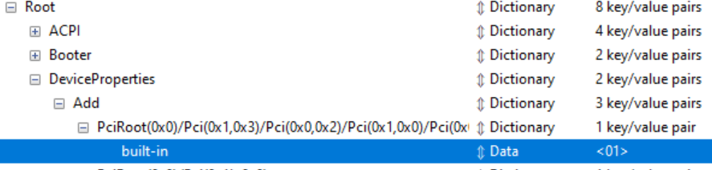

# Lazy Man's Guide: macOS Catalina on AMD <!-- omit in toc -->

- [Introduction](#introduction)
- [Resources and Tools](#resources-and-tools)
  - [References and Guides](#references-and-guides)
  - [Software](#software)
  - [Hardware](#hardware)
- [System Specs](#system-specs)
- [Random Notes](#random-notes)
- [Instructions](#instructions)
  - [Step 1](#step-1)
  - [Step 2](#step-2)
  - [Step 3](#step-3)
  - [Step 4](#step-4)
  - [Step 5](#step-5)
- [Known Issues](#known-issues)
  
## Introduction

This mini-guide is based on my personal experience of installing Hackintosh Catalina on Ryzen from Windows 10. This repo also contains my OpenCore files and config just in case you have the same (or very similar) hardware.

## Resources and Tools
### References and Guides
1. Amd-osx.com Vanilla Guide: https://vanilla.amd-osx.com/ (good starting point but very basic instructions)
2. Snazzy Labs video: https://www.youtube.com/watch?v=l_QPLl81GrY (the mother of all AMD Catalina Hackintosh videos) - you should watch this before doing anything
3. OpenCore AMD Vanilla Desktop Guide: https://khronokernel-2.gitbook.io/opencore-vanilla-desktop-guide/amd-config.plist/amd-config - read only if you run into problems

### Software
1. gibMacOS: https://github.com/corpnewt/gibMacOS
2. SSDT Time: https://github.com/corpnewt/SSDTTime
3. GenSMBIOS: https://github.com/corpnewt/GenSMBIOS 
4. Kexts archive: [https://onedrive.live.com/?authkey=%21APj...](https://onedrive.live.com/?authkey=%21APjCyRpzoAKp4xs&id=FE4038DA929BFB23%21455036&cid=FE4038DA929BFB23)
5. Kext descriptions: https://kb.amd-osx.com/guides/MJ/kexts.html
6. ProperTree: https://github.com/corpnewt/ProperTree
### Hardware
1. Separate disk to install macOS
2. Any USB 3.0 Flash Drive

## System Specs
These are the specs for my AMD system. Files in this repo (OpenCore configuration, drivers and .kexts) work on this hardware.

* CPU Ryzen 2700X, not overclocked
* Motherboard ASRock B450M Pro4
* RAM G-Skill Ripjaws V 2x16Gb 3200 CL16
* Video Sapphire RX 570 4Gb
* SSD A-Data 240Gb SATA3

## Random Notes

1. Clover vs OpenCore. Don't waste your time on Clover, go with OpenCore ("OC"). Even though Clover is simpler, AMD Hackintoshers lean toward OC. macOS Catalina 10.15.3 won't boot from Clover at all.
2. Catalina 10.15.0-3 are still very buggy. If you find any bugs these may be genuine macOS problems, not problems with your setup. Do some search to confirm.
3. If you plan to dualboot, be careful during the installation. You may kill your Windows boot partition.

## Instructions

If your hardware is close enough to mine (same MB, some Ryzen CPU, Polaris graphics card) you can use my OpenCore files from this repo (just put these files on to USB drive formatted as FAT32) and proceed to Step 2.

### Step 1

Watch that Snazzy Labs video. Pay attention to video description. There are useful links and some corrections. Quick summary of Snazzy Lab's instructions:

1. Run gibMacOS.bat (https://youtu.be/l_QPLl81GrY?t=449). This will download all macOS files to your folder.
2. Run MakeInstall.bat (https://youtu.be/l_QPLl81GrY?t=480). This gets the previously downloaded files along with OC to USB drive.
3. Remove unnecessary drivers (https://youtu.be/l_QPLl81GrY?t=545) from your USB drive.
4. Add ApfsDriverLoader.efi and VBoxHfs.efi to drivers folder on your USB drive. You can get theses *.efis [here](https://github.com/acidanthera/AppleSupportPkg/releases).
5. Copy necessary kexts (https://youtu.be/l_QPLl81GrY?t=610). Some folks insist AppleMCEReporterDisabler.kext should be always added to Catalina configs.
6. Deal with DSDTs and SSDTs (whatever this means) by running SSDTTime (https://youtu.be/l_QPLl81GrY?t=696).
7. Deal with _config.plist_ (https://youtu.be/l_QPLl81GrY?t=807), pay attention to *OC Snapshot* step and applying _patches.plist_. 

### Step 2

Even though Snazzy Labs suggest you to boot from the USB drive right away, you need to do few more things with your _config.plist_ before you can proceed.

1. Relax security settings, otherwise you will not be able to boot:
   * Set **RequireVault** and **RequireSignature** to False in _config.plist_ (use Ctrl+F to lookup by key).
   * Also, set *ScanPolicy* to 0.
2. Run _GenSMBIOS_, select option 3, enter _iMacPro1,1_ you'll get result like this:
   ```
      #######################################################
     #              iMacPro1,1 SMBIOS Info                 #
    #######################################################

    Type:         iMacPro1,1
    Serial:       C02V8QZFHX87
    Board Serial: C02734200J9JG36A8
    SmUUID:       0EAA2FD4-34CD-4588-97B3-4FFAD397F669

    Press [enter] to return...
    ```
   Now, you can use any value from GenSMBIOS but if you want working iMessage and FaceTime you need serials recognized by Apple because iMessage's cryptography relies on these values. The only way to get a valid serials is to generate a bunch of them at once (enter _iMacPro1,1 10_ in the option 3 to generate 10 numbers) and then go to https://checkcoverage.apple.com/ and test them manually (look for _Purchase date not validated_, detailed guide [here](https://khronokernel-2.gitbook.io/opencore-vanilla-desktop-guide/extras/iservices)).

3. Set the following keys in **PlatformInfo** -> **Generic**:
   1. **SystemProductName** to `iMacPro1,1`
   2. **SystemSerialNumber** to the value generated by _GenSMBIOS_
   3. **SystemUUID** to the value generated by _GenSMBIOS_
   4. **MLB** to the value generated by _GenSMBIOS_ (**Board Serial**)

4. Set **Quirks** -> **ProvideConsoleGop** to True. 
5. Set **NVRAM** -> **UUID** -> **boot-args** to `-v keepsyms=1 debug=0x100 npci=0x2000 alcid=1`. The latter option is needed for onboard audio of B450M Pro4. If `alcid=1` doesn't work try some other values: 2-5, 7, 12, 15-18, 28, 31, 90, 92, 97, 99 as described [here](https://github.com/acidanthera/applealc/wiki/supported-codecs).

### Step 3

After you configured _config.plist_ (don't forget to save it, btw) you can boot from your USB drive and install macOS Catalina. If your PC won't boot from this USB drive for some reason you can try resetting to UEFI defaults ("Load UEFI defaults" in Boot menu). 

It goes without saying you need to be very careful when selecting your install parition for macOS. macOS doesn't care if partition contains your current Windows install and can kill it in a heartbeat.

**NB!** Also, make sure your Windows boot partition is not affected by macOS. Your Windows EFI boot partition may be located on another drive (this is how I accidentaly disabled my Windows 10 install, it took a while to restore).

### Step 4

If you came from Windows (or even Linux) this step is not immediately obvious. Usually, after installing Windows you can boot into it without problems, because Windows will create all the boot partitions and loaders automatically. Not the case with Hackintosh. 

Once you made sure your macOS works properly you need to copy your OC boot files from USB drive to some boot partition on your hard drive. All you need is some small partition formatted as FAT32. Just copy all files from USB drive to this partition and you are done!

### Step 5

Once you have a working macOS system there may be one more thing to fix. For iMessage and other Apple services (such as FaceTime and Siri) you need to make macOS to recognize your network interface *en0* as built-in. To check if the interface is built-in you can use [DPCIManager](https://sourceforge.net/projects/dpcimanager/). Then you have to find a PCI path for your Ethernet adapter and add this path to _config.plist_ to **DeviceProperties** -> **Add** section like this:



## Known Issues

* USB 2.0 ports don't work in this config. This issue is fixable, but I've got plenty of USB 3.0+ ports so this doesn't bother me.
* Sleep mode doesn't work. There is no known fix to me for Catalina. If sleep is really important for you try Mojave.